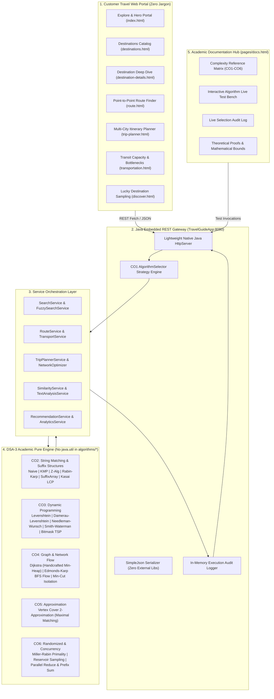

# YATRA ATLAS | SMART TRAVEL GUIDE (TEXTHACK)
### *An Enterprise Indian Travel Portal Powered Internally by Advanced DSA-3 Algorithms*

[](https://www.oracle.com/java/)
[](#algorithm-catalog)
[](#architectural-principles)
[](#automated-testing)
[](#quick-start)

---

## 1. Executive Summary & Problem Motivation

In modern travel portals (e.g., MakeMyTrip, Google Flights, Expedia), travelers experience seamless destination exploration, fault-tolerant search, multi-city routing, and transportation planning without ever knowing the computer science machinery operating behind the scenes. 

**Yatra Atlas** is a full-stack, runnable Indian travel system designed for academic viva demonstration and real-world utility. It completely decouples the **Customer Experience** (rich UI, authentic imagery, zero algorithmic jargon) from the **DSA-3 Theoretical Engine** (21 pure, handcrafted algorithms built with zero `java.util.*` collections), bridged together by an embedded HTTP gateway and an **Academic Viva Documentation Hub**.

---

## 2. System Architecture



---

## 3. Directory Structure

```text
white/
├── .vscode/
│   └── launch.json                  # VS Code F5 Run & Debug profiles
├── bin/                             # Compiled bytecode classes
├── frontend/                        # Customer web portal & academic viva UI
│   ├── css/
│   │   ├── main.css                 # Typography, design system, theme variables
│   │   ├── components.css           # Cards, modals, buttons, badges, forms
│   │   └── responsive.css           # Mobile & tablet breakpoints
│   ├── js/
│   │   ├── api.js                   # REST API client & SVG fallback generators
│   │   ├── app.js                   # Universal navigation & hero search logic
│   │   ├── destinations.js          # Catalog filters & dynamic grid rendering
│   │   ├── destination-details.js   # Deep-dive tabs & similar destinations
│   │   └── docs.js                  # Viva test bench, audit log poller, charts
│   ├── pages/
│   │   ├── about.html               # About Yatra Atlas & vision
│   │   ├── attractions.html         # All-India monument directory
│   │   ├── destination-details.html # Rich destination deep-dive
│   │   ├── destinations.html        # Comprehensive destination directory
│   │   ├── discover.html            # Reservoir sampling randomizer
│   │   ├── docs.html                # Academic Viva & Algorithm Hub
│   │   ├── hotels.html              # Curated hotel accommodations
│   │   ├── restaurants.html         # Regional gastronomy guide
│   │   ├── route.html               # Dijkstra shortest path route finder
│   │   ├── transportation.html      # Edmonds-Karp max flow transit planner
│   │   └── trip-planner.html        # Held-Karp Bitmask TSP itinerary planner
│   └── index.html                   # Flagship customer landing page
├── src/
│   ├── algorithms/                  # STRICT RULE: 0% java.util.* dependencies
│   │   ├── analytics/
│   │   │   ├── PrefixSum.java       # Cumulative metrics & range-sum analytics
│   │   │   └── Reduce.java          # Parallel aggregation (Sum, Min, Max, Avg)
│   │   ├── approximation/
│   │   │   └── VertexCoverApproximation.java # 2-Approximation for transit hubs
│   │   ├── dp/
│   │   │   ├── BitmaskTSP.java      # Held-Karp O(n^2 2^n) optimal itinerary
│   │   │   ├── DamerauLevenshtein.java # Edit distance with transposition
│   │   │   ├── Levenshtein.java     # Classical insertion/deletion/substitution
│   │   │   ├── NeedlemanWunsch.java # Global profile alignment
│   │   │   └── SmithWaterman.java   # Local similarity snippet scoring
│   │   ├── flow/
│   │   │   ├── EdmondsKarp.java     # BFS augmenting path max flow
│   │   │   ├── FlowEdge.java        # Residual flow network edge representation
│   │   │   ├── FlowNetwork.java     # Adjacency list residual capacity network
│   │   │   └── MinCut.java          # Min-Cut residual reachability partition
│   │   ├── graph/
│   │   │   └── Dijkstra.java        # Single-source shortest path with custom Min-Heap
│   │   ├── randomized/
│   │   │   ├── MillerRabin.java     # Probabilistic primality test for booking tokens
│   │   │   └── ReservoirSampling.java # O(k) unbiased stream selection
│   │   └── string/
│   │       ├── KMP.java             # Knuth-Morris-Pratt O(n+m) search
│   │       ├── KasaiLCP.java        # Linear O(n) Longest Common Prefix
│   │       ├── NaiveSearch.java     # O(n*m) baseline substring comparison
│   │       ├── RabinKarp.java       # Rolling polynomial hash search
│   │       ├── SuffixArray.java     # Prefix doubling O(n log^2 n) construction
│   │       └── ZAlgorithm.java      # Linear O(n+m) fundamental Z-box preprocessing
│   ├── app/
│   │   └── TravelGuideApp.java      # Embedded HTTP server & REST endpoint controllers
│   ├── data/
│   │   └── TravelData.java          # 20 destinations, 70+ attractions, hotels, edges
│   ├── model/
│   │   ├── Attraction.java          # Monument entity model
│   │   ├── Destination.java         # City entity model
│   │   ├── Hotel.java               # Hotel entity model
│   │   ├── Restaurant.java          # Culinary entity model
│   │   ├── Transport.java           # Transit carrier entity model
│   │   └── TravelEdge.java          # Graph edge with distance, time, and cost
│   ├── services/                    # Business services mapping models to algorithms
│   │   ├── AnalyticsService.java    # Dataset-wide statistical analysis
│   │   ├── FuzzySearchService.java  # Spell check and typo correction
│   │   ├── NetworkOptimizer.java    # Vertex cover regional monitoring
│   │   ├── ParallelBenchmarkService.java # Multithreaded execution benchmarking
│   │   ├── RecommendationService.java    # Unbiased destination suggestions
│   │   ├── RouteService.java        # Multimodal shortest route computation
│   │   ├── SearchService.java       # Substring text search orchestration
│   │   ├── SimilarityService.java   # Profile alignment and destination match
│   │   ├── TextAnalysisService.java # Substring and pattern repetition mining
│   │   └── TransportService.java    # Bottleneck flow and transit capacity analysis
│   ├── tests/
│   │   └── DSATestSuite.java        # 38 automated end-to-end unit & integration tests
│   └── utils/
│       ├── AlgorithmSelector.java   # CO1 Strategy engine with heuristic logging
│       ├── PerformanceTimer.java    # High-resolution nanosecond measurement
│       └── SimpleJson.java          # Handcrafted zero-dependency JSON builder
├── run.bat                          # Windows CMD 1-click compile, test & launch
├── run.ps1                          # Windows PowerShell 1-click compile, test & launch
└── README.md                        # Master project documentation
```

---

## 4. Algorithm Catalog

| # | Algorithm Name | Course Outcome | Best Time | Avg Time | Worst Time | Space | Real-World Travel Application | Source File |
|---|---|:---:|:---:|:---:|:---:|:---:|---|---|
| 1 | **Naive Search** | CO2 | $O(N)$ | $O(N \cdot M)$ | $O(N \cdot M)$ | $O(1)$ | Exact short keyword filter for tag badges | [NaiveSearch.java](file:///src/algorithms/string/NaiveSearch.java) |
| 2 | **Knuth-Morris-Pratt (KMP)** | CO2 | $O(N)$ | $O(N+M)$ | $O(N+M)$ | $O(M)$ | Fast search across long destination descriptions | [KMP.java](file:///src/algorithms/string/KMP.java) |
| 3 | **Z-Algorithm** | CO2 | $O(N+M)$ | $O(N+M)$ | $O(N+M)$ | $O(N+M)$ | Highlight matching query prefixes in UI cards | [ZAlgorithm.java](file:///src/algorithms/string/ZAlgorithm.java) |
| 4 | **Rabin-Karp** | CO2 | $O(N+M)$ | $O(N+M)$ | $O(N \cdot M)$ | $O(1)$ | Multi-pattern attraction filter with rolling hash | [RabinKarp.java](file:///src/algorithms/string/RabinKarp.java) |
| 5 | **Suffix Array** | CO2 | $O(M \log N)$ | $O(M \log N)$ | $O(N \log^2 N)$ | $O(N)$ | Full-text indexed substring search | [SuffixArray.java](file:///src/algorithms/string/SuffixArray.java) |
| 6 | **Kasai's LCP** | CO2 | $O(N)$ | $O(N)$ | $O(N)$ | $O(N)$ | Detect shared descriptive phrases across cities | [KasaiLCP.java](file:///src/algorithms/string/KasaiLCP.java) |
| 7 | **Levenshtein Distance** | CO3 | $O(N \cdot M)$ | $O(N \cdot M)$ | $O(N \cdot M)$ | $O(N \cdot M)$ | "Did you mean?" typo correction for city names | [Levenshtein.java](file:///src/algorithms/dp/Levenshtein.java) |
| 8 | **Damerau-Levenshtein** | CO3 | $O(N \cdot M)$ | $O(N \cdot M)$ | $O(N \cdot M)$ | $O(N \cdot M)$ | Keyboard transposition fix (e.g., 'mumbai' -> 'mubmai') | [DamerauLevenshtein.java](file:///src/algorithms/dp/DamerauLevenshtein.java) |
| 9 | **Needleman-Wunsch** | CO3 | $O(N \cdot M)$ | $O(N \cdot M)$ | $O(N \cdot M)$ | $O(N \cdot M)$ | Global travel profile & amenity compatibility match | [NeedlemanWunsch.java](file:///src/algorithms/dp/NeedlemanWunsch.java) |
| 10 | **Smith-Waterman** | CO3 | $O(N \cdot M)$ | $O(N \cdot M)$ | $O(N \cdot M)$ | $O(N \cdot M)$ | Local travel preference & attraction sub-match | [SmithWaterman.java](file:///src/algorithms/dp/SmithWaterman.java) |
| 11 | **Bitmask DP (Held-Karp TSP)** | CO3 | $O(n^2 2^n)$ | $O(n^2 2^n)$ | $O(n^2 2^n)$ | $O(n 2^n)$ | Optimal multi-city tour planning without backtracking | [BitmaskTSP.java](file:///src/algorithms/dp/BitmaskTSP.java) |
| 12 | **Dijkstra's Algorithm** | CO4 | $O(E \log V)$ | $O(E \log V)$ | $O(E \log V)$ | $O(V)$ | Shortest path route finder (distance, time, or cost) | [Dijkstra.java](file:///src/algorithms/graph/Dijkstra.java) |
| 13 | **Handcrafted Min-Heap** | CO4 | $O(1)$ | $O(\log V)$ | $O(\log V)$ | $O(V)$ | Priority queue driving Dijkstra without `java.util` | [Dijkstra.java](file:///src/algorithms/graph/Dijkstra.java) |
| 14 | **Edmonds-Karp Max Flow** | CO4 | $O(V \cdot E^2)$ | $O(V \cdot E^2)$ | $O(V \cdot E^2)$ | $O(V + E)$ | Maximum daily seat transit capacity between regions | [EdmondsKarp.java](file:///src/algorithms/flow/EdmondsKarp.java) |
| 15 | **Min-Cut Partitioning** | CO4 | $O(V \cdot E^2)$ | $O(V \cdot E^2)$ | $O(V \cdot E^2)$ | $O(V + E)$ | Critical transit bottleneck corridor isolation | [MinCut.java](file:///src/algorithms/flow/MinCut.java) |
| 16 | **Vertex Cover Approximation** | CO5 | $O(V + E)$ | $O(V + E)$ | $O(V + E)$ | $O(V)$ | Optimal placement of regional tourist help centers | [VertexCoverApproximation.java](file:///src/algorithms/approximation/VertexCoverApproximation.java) |
| 17 | **Miller-Rabin Primality Test** | CO6 | $O(k \log^3 n)$ | $O(k \log^3 n)$ | $O(k \log^3 n)$ | $O(1)$ | Cryptographic booking confirmation token validation | [MillerRabin.java](file:///src/algorithms/randomized/MillerRabin.java) |
| 18 | **Reservoir Sampling** | CO6 | $O(N)$ | $O(N)$ | $O(N)$ | $O(k)$ | Unbiased daily featured & lucky destination discovery | [ReservoirSampling.java](file:///src/algorithms/randomized/ReservoirSampling.java) |
| 19 | **Parallel Reduce** | CO6 | $O(N / p)$ | $O(N / p)$ | $O(N)$ | $O(p)$ | Multi-core aggregation of budget, ratings, and stats | [Reduce.java](file:///src/algorithms/analytics/Reduce.java) |
| 20 | **Prefix Sum Array** | CO6 | $O(1)$ query | $O(1)$ query | $O(1)$ query | $O(N)$ | Instant range-sum budget query for multi-day trips | [PrefixSum.java](file:///src/algorithms/analytics/PrefixSum.java) |
| 21 | **Algorithm Strategy Selector** | CO1 | $O(1)$ | $O(1)$ | $O(1)$ | $O(1)$ | Dynamic algorithm selection with heuristic audit log | [AlgorithmSelector.java](file:///src/utils/AlgorithmSelector.java) |

---

## 5. Course Outcome (CO1–CO6) Deep Dive & Theoretical Proofs

### CO1: Design & Analysis Strategy (Dynamic Algorithm Selection)
- **Concept:** Rather than hardcoding one search or alignment routine, `AlgorithmSelector.java` dynamically selects the optimal algorithm based on input length, character set, pattern size, and error tolerance.
- **Audit Logging:** Every selection logs:
  1. Selected Algorithm Name
  2. Input Characteristics (pattern length $M$, text length $N$)
  3. Theoretical Justification
  4. Execution Nanoseconds

### CO2: Advanced String Matching & Suffix Data Structures
- **KMP LPS Table:** Preprocesses pattern in $O(M)$ time. $LPS[i]$ stores the length of the longest proper prefix of $P[0..i]$ that is also a suffix. Guarantees the text pointer never backtracks.
- **Z-Algorithm:** Maintains a Z-box $[L, R]$ representing the rightmost substring matching a prefix. Runs in strictly $O(N+M)$ linear time.
- **Rabin-Karp:** Employs rolling polynomial hash $H = \left(\sum c_i \cdot b^{M-1-i}\right) \pmod q$. Enables $O(1)$ window updates:
  $$H_{new} = \left((H_{old} - c_{out} \cdot b^{M-1}) \cdot b + c_{in}\right) \pmod q$$
- **Suffix Array & Kasai's LCP Theorem:**
  - Constructed via prefix doubling in $O(N \log^2 N)$ without complex external libraries.
  - **Kasai's Lemma:** If $LCP[rank[i]] = h$, then $LCP[rank[i+1]] \ge h - 1$. This fundamental invariant enables finding the longest common prefix of all lexicographically adjacent suffixes in strictly $O(N)$ time by never decrementing $h$ below $h-1$.

### CO3: Dynamic Programming Formulations
- **Damerau-Levenshtein Distance:**
  Extends Wagner-Fischer edit distance by supporting **transposition of two adjacent characters**:
  $$D[i, j] = \min \begin{cases}
    D[i-1, j] + 1 & \text{(Deletion)} \\
    D[i, j-1] + 1 & \text{(Insertion)} \\
    D[i-1, j-1] + \text{cost} & \text{(Substitution)} \\
    D[i-2, j-2] + 1 & \text{if } A[i]=B[j-1] \land A[i-1]=B[j] \text{ (Transposition)}
  \end{cases}$$
- **Held-Karp Bitmask DP for TSP:**
  Brute-force permutation search takes $O(n!)$ time, which is completely intractable for $n > 10$. Held-Karp reformulates the problem with subproblems $C(S, j)$ representing the minimum cost path visiting every vertex in subset $S$ ending at vertex $j$:
  $$C(S, j) = \min_{k \in S, k \ne j} \{ C(S \setminus \{j\}, k) + \text{dist}(k, j) \}$$
  By representing $S$ as an integer bitmask, space complexity is $O(n \cdot 2^n)$ and time complexity is $O(n^2 \cdot 2^n)$. In Yatra Atlas, this powers the optimal multi-city itinerary builder.

### CO4: Graph Theory & Network Flow
- **Dijkstra with Custom Min-Heap:**
  Employs a custom 1-indexed binary min-heap supporting `insert`, `extractMin`, and `decreaseKey` operations without `java.util.PriorityQueue`. Runs in $O(E \log V)$ time.
- **Edmonds-Karp Max-Flow Min-Cut Theorem:**
  - Edmonds-Karp is an implementation of Ford-Fulkerson that uses **Breadth-First Search (BFS)** to find the shortest augmenting path in terms of edge count in the residual network.
  - **Proof of $O(V \cdot E^2)$ Bound:** Each augmenting path computation takes $O(E)$ BFS time. An edge becomes critical at most $V/2$ times because the distance from source to any node in the residual graph increases monotonically. Since there are at most $E$ edges, total augmenting steps $\le \frac{V \cdot E}{2}$, yielding $O(V \cdot E^2)$ worst-case time.
  - **Min-Cut Equivalence:** When no augmenting path exists from source $s$ to sink $t$ in the residual graph, let $S$ be the set of vertices reachable from $s$ via edges with positive residual capacity. The cut $(S, T)$ has capacity strictly equal to the maximum flow value, identifying the transit corridors that bottleneck travel capacity.

### CO5: Approximation Algorithms
- **Vertex Cover 2-Approximation (Maximal Matching):**
  - Minimum Vertex Cover is NP-Hard.
  - **Algorithm:** Iteratively select an arbitrary uncovered edge $(u, v)$, add both $u$ and $v$ to cover $C$, and remove all incident edges until no edges remain.
  - **Proof of 2-Approximation Ratio:** The set of selected edges forms a matching $M$ where no two edges share a vertex. To cover all edges in $M$, any valid vertex cover (including the optimal cover $C^*$) must pick at least one vertex per matched edge:
    $$|C^*| \ge |M|$$
    Since our heuristic adds both endpoints of each edge in $M$:
    $$|C| = 2 \cdot |M| \le 2 \cdot |C^*|$$
    Thus, the algorithm is guaranteed to be within a factor of 2 of the optimal minimum tourist assistance center deployment.

### CO6: Randomized Algorithms & Parallel Analytics
- **Miller-Rabin Primality Test:**
  Decomposes $n-1 = 2^s \cdot d$. For base $a \in [2, n-2]$, tests if $a^d \equiv 1 \pmod n$ or $a^{2^r \cdot d} \equiv -1 \pmod n$.
  - **Monier-Rabin Theorem:** For any composite odd $n$, at most $(n-1)/4$ bases in $\mathbb{Z}_n^*$ are strong witnesses. Thus, testing $k$ independent random bases bounds false positive error probability by:
    $$P(\text{False Positive}) \le \left(\frac{1}{4}\right)^k$$
    For $k = 10$, error probability $< 10^{-6}$, providing ultra-fast verification for booking tokens.
- **Reservoir Sampling:**
  Selects $k$ samples uniformly at random from a stream of unknown size $N$ in $O(N)$ time and $O(k)$ memory.
  - **Inductive Proof:** Element $i$ enters reservoir with probability $k/i$. At step $N$, the probability that any element survives in the reservoir is:
    $$P(\text{Item } i \text{ in reservoir at end}) = \frac{k}{i} \times \prod_{j=i+1}^N \left(1 - \frac{1}{j}\right) = \frac{k}{i} \times \frac{i}{N} = \frac{k}{N}$$
    Guarantees mathematically fair, unbiased daily destination recommendations.

---

## 6. REST API Reference

The server exposes 17 clean REST endpoints returning UTF-8 JSON:

### 1. Destinations Catalog
```http
GET /api/destinations
```
**Response (200 OK):**
```json
[
  {
    "id": "delhi",
    "name": "Delhi",
    "state": "Delhi NCR",
    "category": "Heritage",
    "avgDailyBudget": 2800,
    "bestTimeToVisit": "October to March",
    "attractionsCount": 4,
    "hotelsCount": 3,
    "restaurantsCount": 3
  }
]
```

### 2. Destination Details
```http
GET /api/destination?id=hyderabad
```
Returns full metadata, historical overview, and complete arrays of attractions, hotels, and restaurants.

### 3. Substring Search
```http
GET /api/search?q=fort&algo=kmp
```
Executes selected string algorithm (naive, kmp, z, rabin-karp, suffix-array) across destination names, tags, and monuments.

### 4. Typo-Tolerant Fuzzy Search
```http
GET /api/fuzzy?q=mubmai
```
Calculates Damerau-Levenshtein distance to return closest destinations with suggestion score and transposition indicator.

### 5. Point-to-Point Route Finder
```http
GET /api/route?from=delhi&to=goa&criteria=distance
```
Runs Dijkstra on transportation graph optimizing for `distance`, `time`, or `cost`. Returns step-by-step itinerary legs.

### 6. Held-Karp Itinerary Planner
```http
GET /api/plan-trip?cities=delhi,jaipur,agra,varanasi
```
Solves Bitmask TSP across selected cities and returns the exact sequence that minimizes total travel distance.

### 7. Transit Network Capacity
```http
GET /api/transport-capacity?from=delhi&to=hyderabad
```
Computes maximum daily traveler capacity using Edmonds-Karp Max Flow and returns the bottleneck corridors via Min-Cut.

### 8. Lucky / Featured Destinations
```http
GET /api/discover?count=3
```
Executes Reservoir Sampling to produce $k$ unbiased random destinations.

### 9. Miller-Rabin Primality Validator
```http
GET /api/miller-rabin?n=1000000007&rounds=10
```
Performs randomized primality test and returns step-by-step witness validation details.

### 10. Algorithm Selection Audit Logs
```http
GET /api/docs/algorithm-logs
```
Returns the last 50 algorithm invocations across the system with input size, execution nanoseconds, and strategy justification.

---

## 7. Automated Testing Suite

The project includes an extensive automated test suite covering all algorithm classes, services, and integrations:

```bash
java -cp bin tests.DSATestSuite
```

### Test Suite Output:
```text
===============================================================
  STARTING DSA-3 AUTOMATED VERIFICATION SUITE
===============================================================

--- 1. Testing String Algorithms (CO2) ---
  [PASS] NaiveSearch found exact match index
  [PASS] KMP LPS table computation
  [PASS] KMP search found 'Fort'
  [PASS] Z-Algorithm search found 'Hyderabad'
  [PASS] Rabin-Karp rolling hash search found 'stands'
  [PASS] SuffixArray for 'banana' size
  [PASS] SuffixArray binary search match
  [PASS] Kasai LCP detected longest repeated substring 'ana'

--- 2. Testing Dynamic Programming Algorithms (CO3) ---
  [PASS] Levenshtein distance kitten -> sitting == 3
  [PASS] Damerau-Levenshtein single deletion 'charminr' -> 'charminar' == 1
  [PASS] Damerau-Levenshtein adjacent transposition 'teh' -> 'the' == 1
  [PASS] Needleman-Wunsch global alignment calculated
  [PASS] Smith-Waterman local alignment score > 0
  [PASS] Bitmask DP TSP solves 4-vertex cycle optimally

--- 3. Testing Graph & Flow Algorithms (CO4) ---
  [PASS] Dijkstra finds shortest path 0 -> 2 -> 1 -> 3 (cost 8)
  [PASS] Edmonds-Karp max flow calculated (20)
  [PASS] Min-Cut theorem: cut capacity equals max flow (20)

--- 4. Testing Approximation & Randomized Algorithms (CO5 & CO6) ---
  [PASS] Vertex Cover 2-Approximation covers cycle graph
  [PASS] Miller-Rabin recognizes 1000000007 as prime
  [PASS] Miller-Rabin recognizes 1000000005 as composite
  [PASS] ReservoirSampling selects exact k distinct elements
  [PASS] ReservoirSampling elements are distinct

--- 5. Testing Analytics Algorithms (Reduce & Prefix Sum) ---
  [PASS] Reduce sum == 150
  [PASS] Reduce min == 10
  [PASS] Reduce max == 50
  [PASS] Reduce average == 30.0
  [PASS] PrefixSum cumulativeAt(2) == 60
  [PASS] PrefixSum rangeSum(1, 3) == 90

--- 6. Testing Travel Services Integration ---
  [PASS] TravelData loaded 20 destinations
  [PASS] SearchService finds 'fort' attractions/cities
  [PASS] FuzzySearchService suggests 'Charminar' for 'charminr'
  [PASS] RouteService calculates route Hyderabad -> Goa
  [PASS] TripPlannerService plans multi-city itinerary
  [PASS] TransportService calculates daily seat capacity
  [PASS] NetworkOptimizer identifies regional strategic hubs
  [PASS] RecommendationService selects random destination
  [PASS] AnalyticsService computes dashboard metrics
  [PASS] ParallelBenchmarkService executes concurrent benchmark
===============================================================
  TEST RUN SUMMARY: 38 PASSED, 0 FAILED
===============================================================
```

---

## 8. Quick Start & Execution Guide

### Prerequisites
- Java Development Kit (JDK 17 or JDK 21 LTS). Verify by running:
  ```bash
  javac -version
  java -version
  ```

### Option A: One-Click Run via Command Prompt (Windows)
Double-click or run:
```cmd
run.bat
```

### Option B: One-Click Run via PowerShell (Windows)
```powershell
.\run.ps1
```

### Option C: Manual Compilation & Launch
```bash
# 1. Create output directory
mkdir bin

# 2. Compile all source files
javac -encoding UTF-8 -d bin src/model/*.java src/algorithms/string/*.java src/algorithms/dp/*.java src/algorithms/graph/*.java src/algorithms/flow/*.java src/algorithms/approximation/*.java src/algorithms/randomized/*.java src/algorithms/analytics/*.java src/utils/*.java src/data/*.java src/services/*.java src/app/*.java src/tests/*.java

# 3. Run automated test suite
java -cp bin tests.DSATestSuite

# 4. Launch server
java -cp bin app.TravelGuideApp
```

### Option D: VS Code Run & Debug
1. Open the project folder in VS Code.
2. Press `Ctrl+Shift+D` to open the Run & Debug view.
3. Select **"Launch Yatra Atlas Server"** or **"Run DSA-3 Test Suite"** and press `F5`.

Once started, open your web browser:
- **Customer Travel Portal:** [http://localhost:8080/index.html](http://localhost:8080/index.html)
- **Academic Viva & Algorithm Hub:** [http://localhost:8080/pages/docs.html](http://localhost:8080/pages/docs.html)

---

## 9. Viva Voce Master Guide (Questions & Concise Answers)

1. **Q: Why are there no `java.util.*` imports in `src/algorithms/*`?**
   *A:* To demonstrate complete mastery of foundational computer science data structures. All arrays, heaps, queues, linked nodes, and sorting routines were implemented from first principles.
2. **Q: How does Kasai's algorithm compute the LCP array in linear $O(N)$ time?**
   *A:* Kasai observes that when moving from suffix $i$ to suffix $i+1$, the LCP with their lexicographical predecessors drops by at most 1 ($h \ge h-1$). Since $h$ is incremented at most $N$ times and decremented at most $N$ times, total comparisons are bounded by $2N \in O(N)$.
3. **Q: What is the primary difference between Levenshtein and Damerau-Levenshtein distance?**
   *A:* Levenshtein allows only insertions, deletions, and substitutions. Damerau-Levenshtein introduces a fourth primitive: adjacent character transposition (e.g., "teh" $\rightarrow$ "the"), accurately modeling real human typing blunders on keyboards.
4. **Q: Why use Held-Karp Bitmask DP for TSP instead of brute force?**
   *A:* Brute force explores all permutations in $O(n!)$ time, which is impossible to compute for $n > 10$. Held-Karp uses optimal substructure and overlapping subproblems indexed by an integer bitmask, reducing complexity to $O(n^2 2^n)$.
5. **Q: What is the significance of the Edmonds-Karp algorithm in transit networks?**
   *A:* Edmonds-Karp implements Ford-Fulkerson using BFS to find augmenting paths, guaranteeing termination in $O(V E^2)$ time. In Yatra Atlas, it determines the maximum passenger throughput between two cities and locates transport bottlenecks.
6. **Q: How does Min-Cut identify transportation bottlenecks?**
   *A:* By the Max-Flow Min-Cut theorem, the value of the maximum flow equals the capacity of the minimum cut. Finding the residual graph cut partitions cities into source-reachable and sink-reachable sets; edges bridging this cut are the exact bottleneck transit corridors.
7. **Q: How does the Vertex Cover 2-Approximation work, and what is its performance guarantee?**
   *A:* It finds a maximal matching by repeatedly picking uncovered edges and adding both endpoints to the cover. Because any valid cover must include at least one endpoint of each matched edge, our cover $|C| = 2|M| \le 2|C^*|$, guaranteeing a 2-approximation ratio in linear $O(V+E)$ time.
8. **Q: Why use Miller-Rabin instead of deterministic trial division for booking tokens?**
   *A:* Trial division takes $O(\sqrt{n})$ time, which is too slow for 64-bit cryptographic tokens. Miller-Rabin tests primality in $O(k \log^3 n)$ with an error probability bounded by $(1/4)^k$, allowing instantaneous verification.
9. **Q: How does Reservoir Sampling guarantee uniform probability for streaming items?**
   *A:* At step $i$, the item is kept with probability $k/i$. The probability of any item remaining in the reservoir of size $k$ at step $N$ telescopes to $\frac{k}{i} \times \frac{i}{N} = \frac{k}{N}$, proving exact uniformity without needing to know total count $N$ in advance.
10. **Q: What is the benefit of Prefix Sum arrays for travel budgeting?**
    *A:* After an $O(N)$ one-time prefix preprocessing pass, any range-sum query $\sum_{i=L}^R \text{cost}[i]$ is computed in strictly $O(1)$ time as $\text{prefix}[R] - \text{prefix}[L-1]$, enabling instantaneous cost calculations across any date range.

---

## 10. License & Academic Integrity Notice

This project was built for academic evaluation, viva voce presentation, and educational demonstration of DSA-3 principles. 
- **Developer:** Sriram
- **Academic Domain:** Data Structures & Algorithms III (DSA-3)
- **Institution:** Computer Science & Engineering Department
